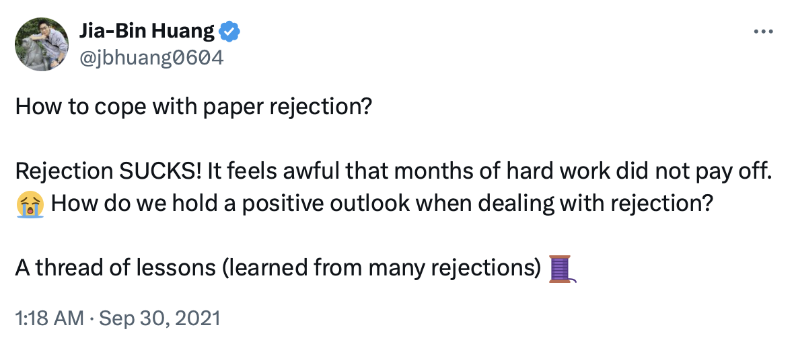
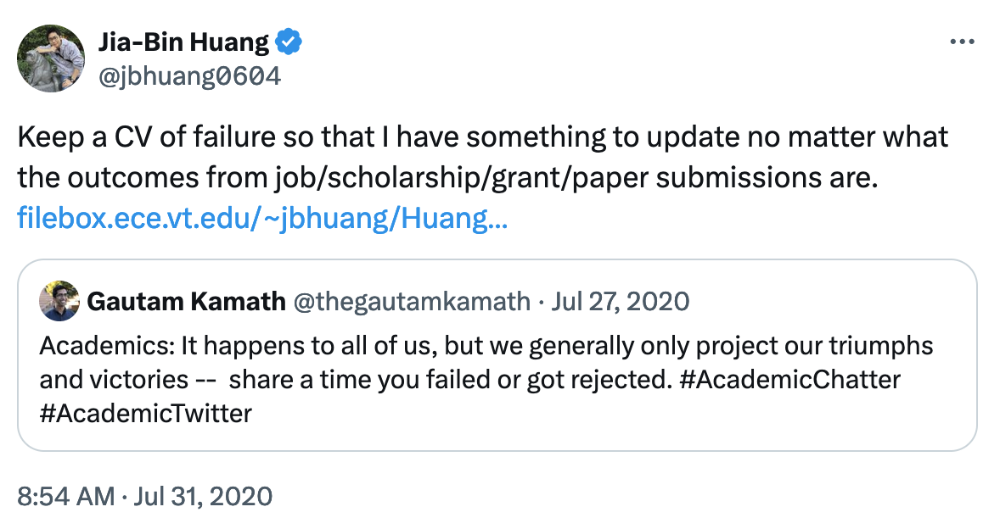

# CV of Failures

Inspired by [Jia-Bin Huang](https://jbhuang0604.github.io/)'s "[CV of Failures](https://jbhuang0604.github.io/Huang_CV_Failure.pdf)" concept, this repository contains my own Curriculum Vitae of Failures. It documents rejections, setbacks, and unsuccessful attempts in my academic journey.

Jia-Bin Huang mentioned the concept of a CV of Failures in his "[awesome-tips](https://github.com/jbhuang0604/awesome-tips)" series, specifically in the "[How to cope with paper rejection?](https://x.com/jbhuang0604/status/1443248831102136333)".

On dealing with rejection:

He emphasied this idea in a thread about the importance of sharing failures:
> *Maintain a CV of failures!*
> You failed because you tried! Create a CV of failures to normalize all these setbacks.
>  

He also said about failure in 2020:

## Why Share Failures?
1. Provide a more balanced view of my career path
2. Normalize failure as part of the growth process
3. Encourage resilience and perseverance in the face of setbacks

The main document in this repository is `CV_of_Failures.pdf`, which contains my list of rejections and unsuccessful attempts. I also share the LaTeX source file (`CV_of_Failures.tex`) that Huang didn't make public. The template is identical to [his](https://jbhuang0604.github.io/Huang_CV_Failure.pdf), with only the text color being different.

While this is a personal document, I welcome discussions about the concept of failure CVs. Feel free to open an issue if you'd like to share your thoughts or experiences.

As Huang suggested, sharing our failures can be a **"(tiny) contribution to academics"** by helping others feel better about their own setbacks. In this spirit, I hope that by sharing my personal failures, this CV can help normalise the struggles and make academia more open and resilent.